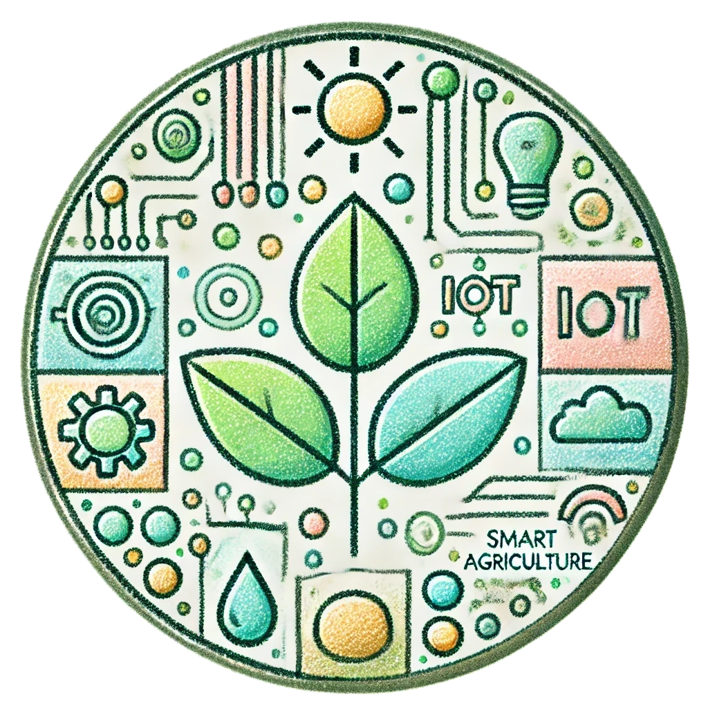

<!-- PROJECT SHIELDS -->
[![Contributors][contributors-shield]][contributors-url]
[![Commit Activity][commit-shield]][commit-url]
[![Last Commit][last-commit-shield]][last-commit-url]
[![License][license-shield]][license-url]

<!-- PROJECT LOGO -->
 

  

<h3 align="center">Smart Agriculture - Field Monitoring System</h3>

  

    University IoT project for intelligent monitoring of agricultural fields. It includes sensor simulation (soil moisture, temperature, pH, water salinity, relative humidity, rainfall) and automatic alert generation for critical conditions. The system aims to optimise resource management and improve agricultural efficiency.
     
    <a href="https://github.com/Alemato/Smart-Agriculture-Field-Monitoring-System"><strong>Explore all docs »</strong></a>
  

<!-- TABLE OF CONTENTS -->

  
Table of Contents

  <ol>
    <li>
      <a href="#Smart-Agriculture-Field-Monitoring-System">Project Overview</a>
    </li>
    <li><a href="#exam-Requirements">Exam Requirements</a></li>
<!--
    <li>
            <a href="#component-diagram">Component Diagram</a>
        <ul>
            <li><a href="#components">Components</a></li>
            <li><a href="#additional-notes">Additional Notes</a></li>
        </ul>
    </li>
-->
    <li>
      <a href="#implementation">Implementation</a>
      <ul>
        <li><a href="#sensor-simualtion">Sensor Simulator</a></li>
      </ul>
    </li>
    <li><a href="https://github.com/Alemato/Smart-Agriculture-Field-Monitoring-System/blob/main/LICENSE">License</a></li>
  </ol>

<!-- MARKDOWN LINKS & IMAGES -->
<!-- https://www.markdownguide.org/basic-syntax/#reference-style-links -->

[contributors-shield]: https://img.shields.io/github/contributors/Alemato/Smart-Agriculture-Field-Monitoring-System?style=for-the-badge

[contributors-url]: https://github.com/Alemato/Smart-Agriculture-Field-Monitoring-System/graphs/contributors

[commit-shield]: https://img.shields.io/github/commit-activity/t/Alemato/Smart-Agriculture-Field-Monitoring-System?style=for-the-badge

[commit-url]: https://github.com/Alemato/Smart-Agriculture-Field-Monitoring-System/graphs/commit-activity

[last-commit-shield]: https://img.shields.io/github/last-commit/Alemato/Smart-Agriculture-Field-Monitoring-System?style=for-the-badge

[last-commit-url]: https://github.com/Alemato/Smart-Agriculture-Field-Monitoring-System/graphs/commit-activity

[license-shield]: https://img.shields.io/github/license/Alemato/Smart-Agriculture-Field-Monitoring-System?style=for-the-badge

[license-url]: https://github.com/Alemato/Smart-Agriculture-Field-Monitoring-System/blob/master/LICENSE.txt

# Smart Agriculture - Field Monitoring System

University IoT project for intelligent monitoring of agricultural fields. It includes sensor simulation (soil moisture,
temperature, pH, water salinity, relative humidity, rainfall) and automatic alert generation for critical conditions.
The system aims to optimise resource management and improve agricultural efficiency.

## Exam Requirements

The project meets all the requirements described in the following file:
[SE4IOT_ Requirement_Document_for_the_IoT_System_Development_Project.pdf](docs/SE4IOT_%20Requirement_Document_for_the_IoT_System_Development_Project.pdf)

(<a href="#readme-top">Back to table of contents</a>)

# Implementation
## Sensor Simulation

Sensor Simulation

(<a href="#readme-top">Back to table of contents</a>)

